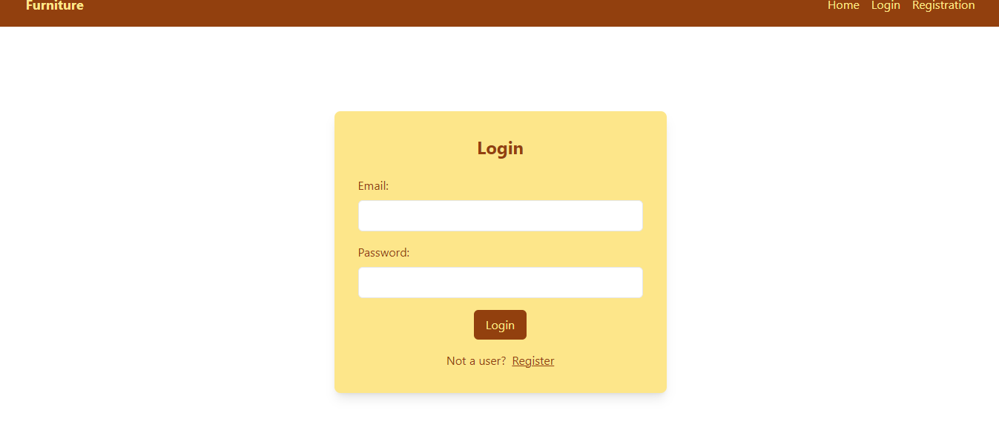
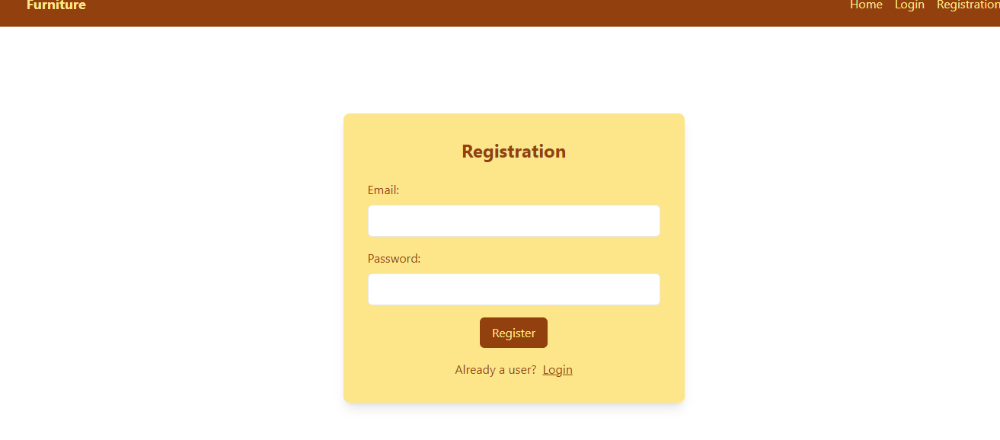
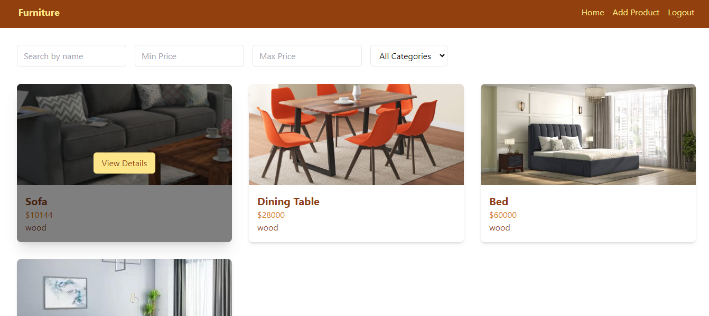
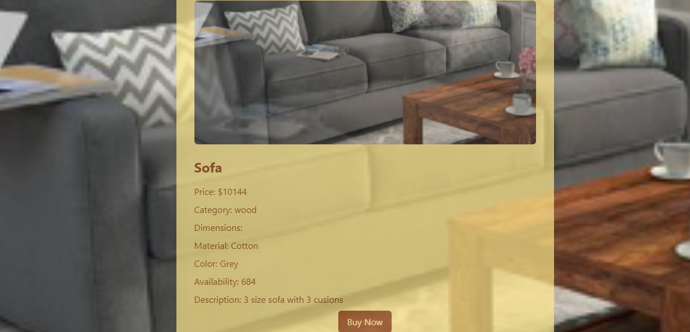
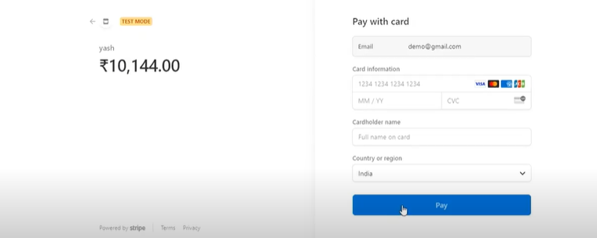
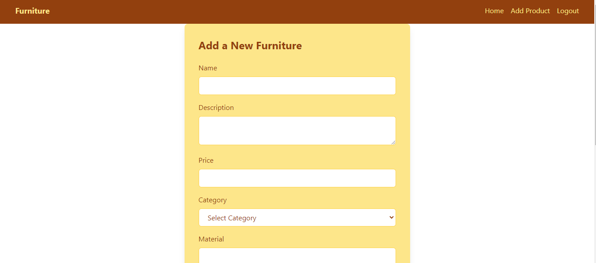
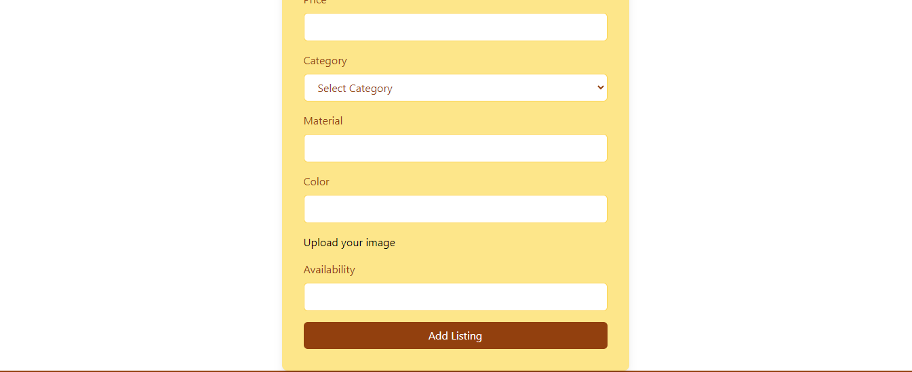
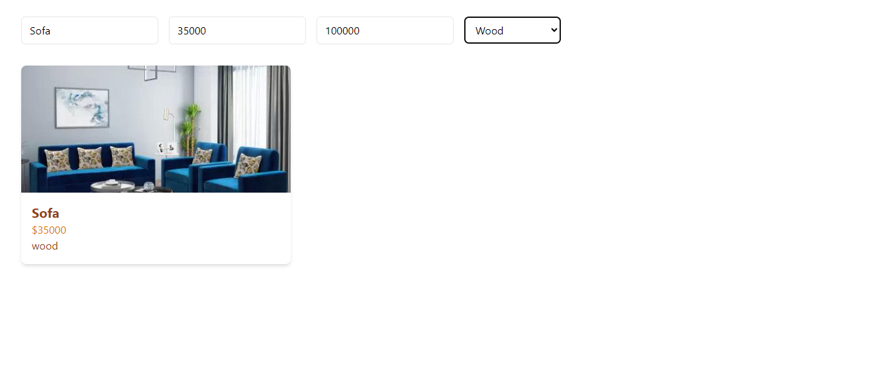

# Furniture Web Application

Welcome to the Furniture Web Application! This platform allows users to explore, buy, and sell furniture with ease.

## Core Functionalities

### Login

### Registration

### View and Buy Furniture
Users can see details of the furniture and make purchases.

### List Your Furniture
Users can list their furniture for sale.

### Search and Filter Functionality
Users can search for furniture and apply filters to find what they need.

### Logout
### Responsive Desig

## Tech Stack

- **React**: Frontend library for building user interfaces.
- **Firebase**: Backend services including authentication and Firestore.
- **Tailwind**: For UI and UX.
- **Stripe**: Payment processing integration.

